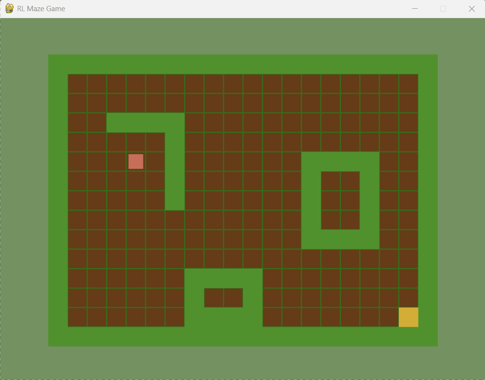
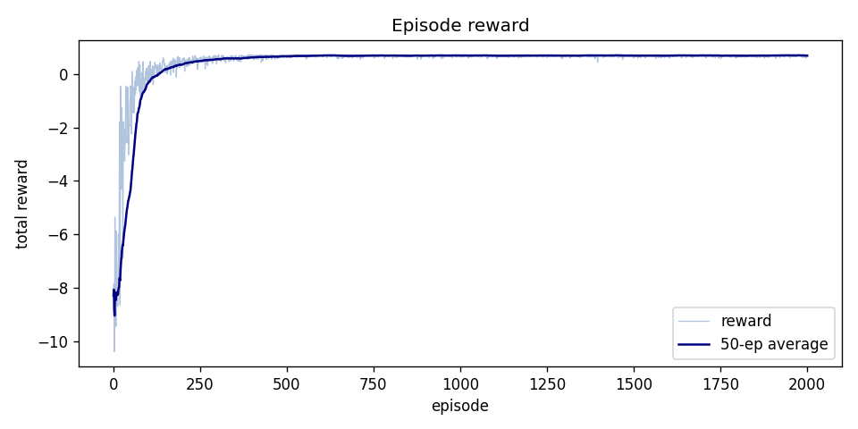
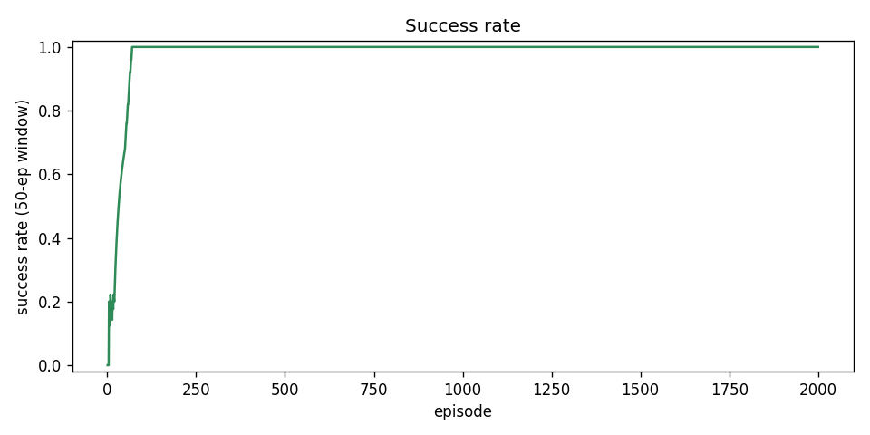
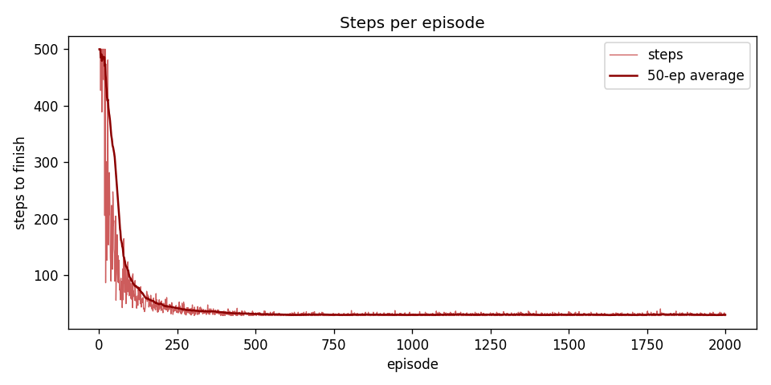

# RL Maze Game

A 2D maze game where a reinforcement learning agent learns to navigate from start to goal using the Dyna-Q algorithm. Built with Pygame, Gymnasium, and NumPy.



---

## Project Structure

The codebase is modularized to keep the game engine separate from the training environment:

- **`src/game/`**: Game logic (grid layout, player coordinates, and collision checks).
- **`src/env/`**: Gymnasium environment wrapper handling actions, observations, and rewards.
- **`src/rl/`**: Dyna-Q agent implementation, training, and evaluation utilities.
- **`src/rendering/`**: Pygame visualization.
- **`src/analysis/`**: Metric logging and plotting tools.
- **`tests/`**: Unit tests for the environment and movement logic.

---

## Setup & Usage

Ensure you have **Python 3.11** installed and activate your environment:

```bash
conda activate hermes
pip install -r requirements.txt
```

### Manual Play (Arrow keys / WASD)
```bash
python src/main.py
```

### Train the Dyna-Q Agent
```bash
python -m src.rl.train --episodes 1000 --plot
```

### Watch the Trained Agent Play
```bash
python -m src.rl.watch --checkpoint models/dyna_q_final --no-train
```

### Run Evaluation
```bash
python -m src.rl.evaluate models/dyna_q_final
```

### Run Tests
```bash
pytest tests/
```

---

## Hyperparameters & Tuning

All parameters are configured in [`src/config.py`](src/config.py). Modify them directly to tune agent behavior:

- `PLANNING_STEPS`: Simulated planning updates performed per real step.
- `ALPHA`: Q-learning learning rate.
- `GAMMA`: Discount factor.
- `EPSILON_DECAY`: Exploration decay rate.
- `STEP_PENALTY` / `WALL_PENALTY` / `GOAL_REWARD`: Reward structure weights.

---

## Training Performance & Charts

When running training with the `--plot` flag, performance charts are saved to the `results/` folder:

| Training Reward | Success Rate | Steps per Episode |
| :---: | :---: | :---: |
|  |  |  |

- **Reward**: Total reward accumulated per episode.
- **Success Rate**: The rate at which the agent reaches the goal.
- **Steps**: Path length taken by the agent.